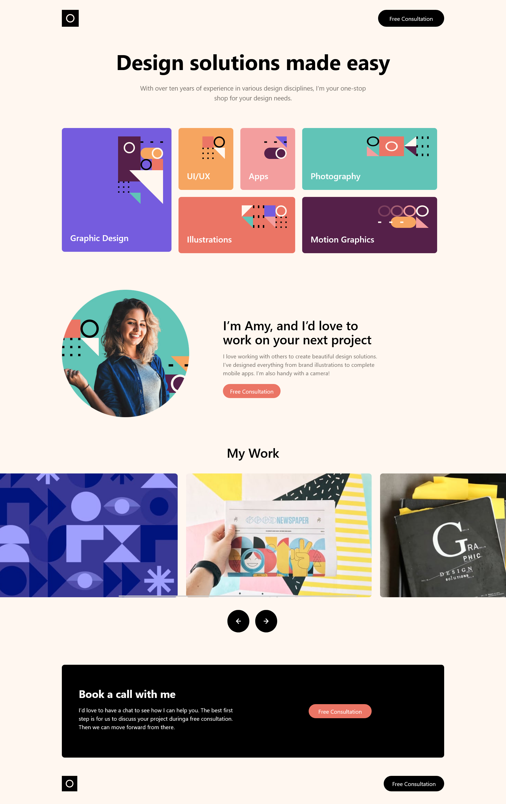

# Frontend Mentor - Single-page design portfolio solution

This is a solution to the [Single-page design portfolio challenge on Frontend Mentor](https://www.frontendmentor.io/challenges/singlepage-design-portfolio-2MMhyhfKVo).

## Table of contents

- [Overview](#overview)
  - [The challenge](#the-challenge)
  - [Screenshot](#screenshot)
  - [Links](#links)
- [My process](#my-process)
  - [Built with](#built-with)
  - [What I learned](#what-i-learned)
  - [Continued development](#continued-development)
- [Author](#author)


## Overview

### The challenge

Users should be able to:

- View the optimal layout for the site depending on their device's screen size
- See hover states for all interactive elements on the page
- Navigate the slider using either their mouse/trackpad or keyboard

### Screenshot




### Links

- Solution URL: [Add solution URL here](https://github.com/uvdevelop26/single-page-desing-portfolio-uv)
- Live Site URL: [Add live site URL here](https://your-live-site-url.com)

## My process

### Built with

- Semantic HTML5 markup
- [Tailwind](https://tailwindcss.com/)
- CSS Grid
- Mobile-first workflow

### What I learned


in this challenge I learned about the "scrollLeft" property, it turns out doesn't matter how many times you reload the page you always have to add more (for each click) for the element to be scrolled
```js
btnRight.addEventListener('click', () => {
    const list = lists[0].clientWidth
    slider.scrollLeft += list

})

btnLeft.addEventListener('click', () => {
    const list = lists[0].clientWidth
    slider.scrollLeft -= list
});
```


### Continued development

I definitely want to focus more on learning about css grid techniques, in this challenge everything was relatively easy but i know things are gonna get more difficult


## Author

- Frontend Mentor - [@uvdevelop26](https://www.frontendmentor.io/profile/uvdevelop26)


